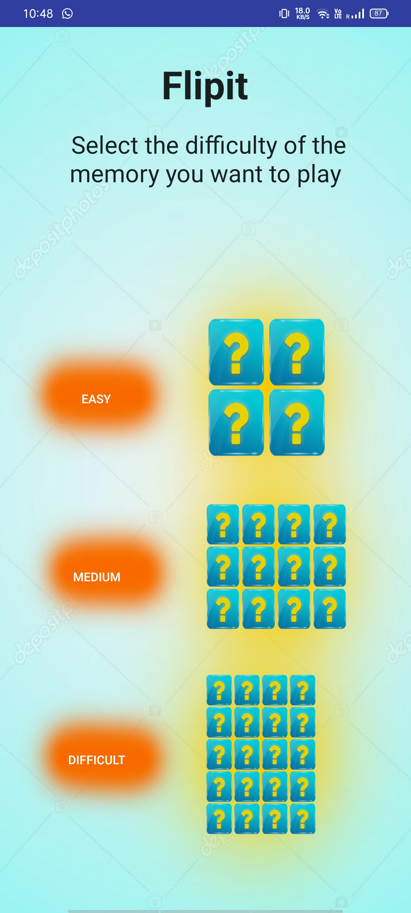
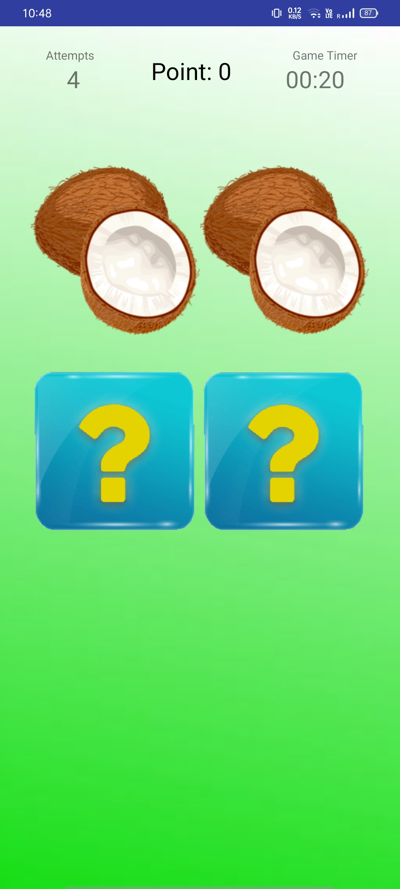
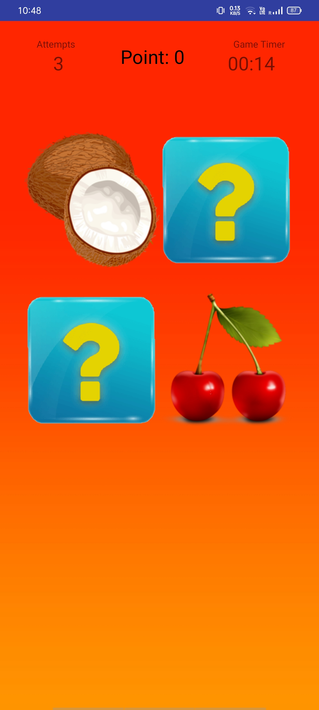
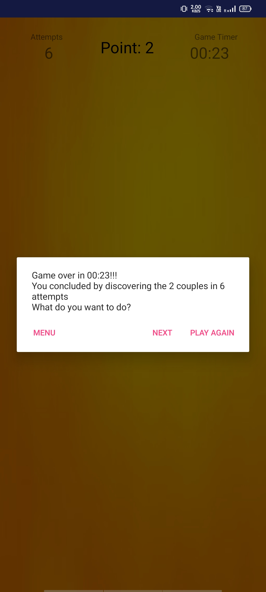

# Flipit

FlipIt is a game created in Android Studio.  
The application has 3 main levels: easy, medium and hard where all the tiles are shuffled when a new game is opened.  
The game has the numbers of the attempts, the score and timer.  
When a game is over the app asks you if you want to play again.

## How to play

Hard way: add the repository to visual studio code and compile the application from there, then test it in a emulator.

## Screenshots

  
  
  
  

